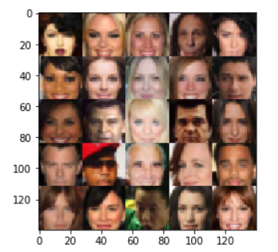

# face_generator
using GAN to generate human faces

## GAN structure:
Discriminator:
(conv+bn+lrelu+dropout)*3+fc

Generator:
fc+bn+lrelu+dropout+(convt+bn+lrelu+dropout)*2+convt
## dataset
CelebA: FloydHub data ID: R5KrjnANiKVhLWAkpXhNBe
## result
After 1 epoch of training:

